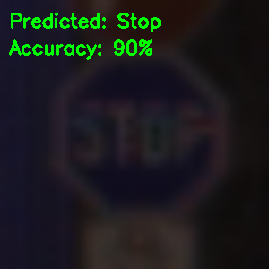

# 🚦 Traffic Sign Detection & Classification

A real-time traffic sign detection system built with Python, CNNs, and OpenCV.
Trained on the GTSRB dataset (43 classes, 50,000+ images) and deployable both
locally via webcam and as a web app for image uploads.

**Test Accuracy: 90%**

---

## 🎯 What it does

- Classifies 43 types of traffic signs from images or live webcam feed
- Trained from scratch using a Convolutional Neural Network (CNN)
- Handles class imbalance via image augmentation
- Deployable locally (`local_app.py`) or as a server app (`app.py`)

---

## 🏗️ Architecture
---

## 🛠️ Tech Stack

| Layer | Tools |
|---|---|
| Model | TensorFlow / Keras |
| Computer Vision | OpenCV |
| Data Processing | NumPy, Pandas |
| Visualization | Matplotlib, Seaborn |
| Dataset | [GTSRB](http://benchmark.ini.rub.de/) |

---

## 🚀 Run Locally

```bash
git clone https://github.com/T-hubbb/traffic-signal-detector
cd traffic-signal-detector
pip install -r requirements.txt

# Webcam (real-time)
python local_app.py

# Upload image (web app)
python app.py
```

---

## 📊 Sample Output



---

## 🔮 What I'd improve next

- Containerise with Docker for one-command deployment
- Add confidence scores to predictions ("92% — Stop Sign")
- Replace with MobileNet for faster inference on edge/embedded devices
- Train on full GTSRB with better augmentation pipeline

---

## 📁 Project Structure

| File | Purpose |
|---|---|
| `Traffic_signal_model_training.ipynb` | Full training pipeline |
| `model.h5` | Saved trained model |
| `app.py` | Web app (image upload) |
| `local_app.py` | Local webcam detection |
| `test.py` | Evaluation & metrics |
| `output.png` | Sample prediction output |
| `requirements.txt` | All dependencies |
